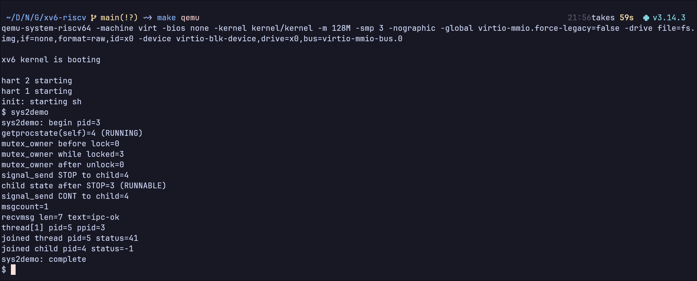
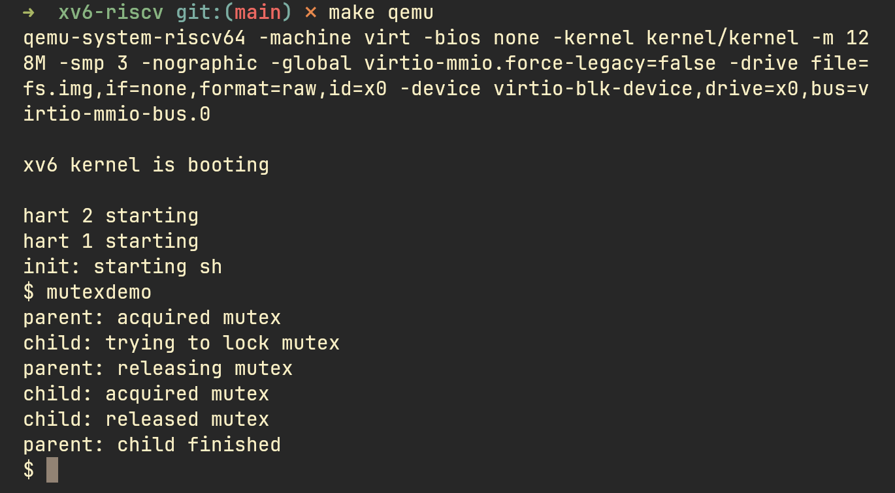
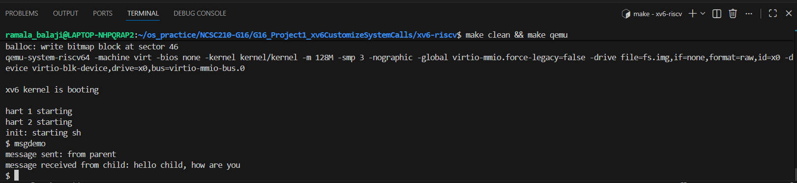
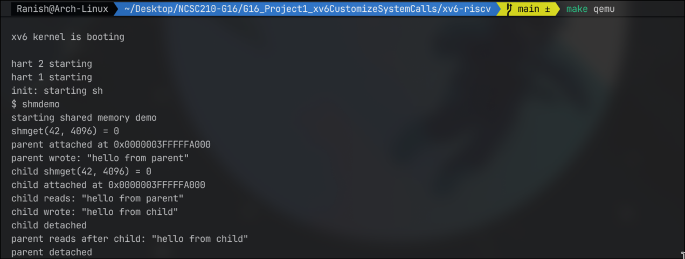
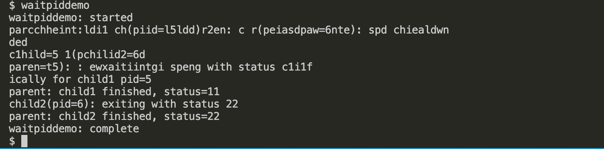
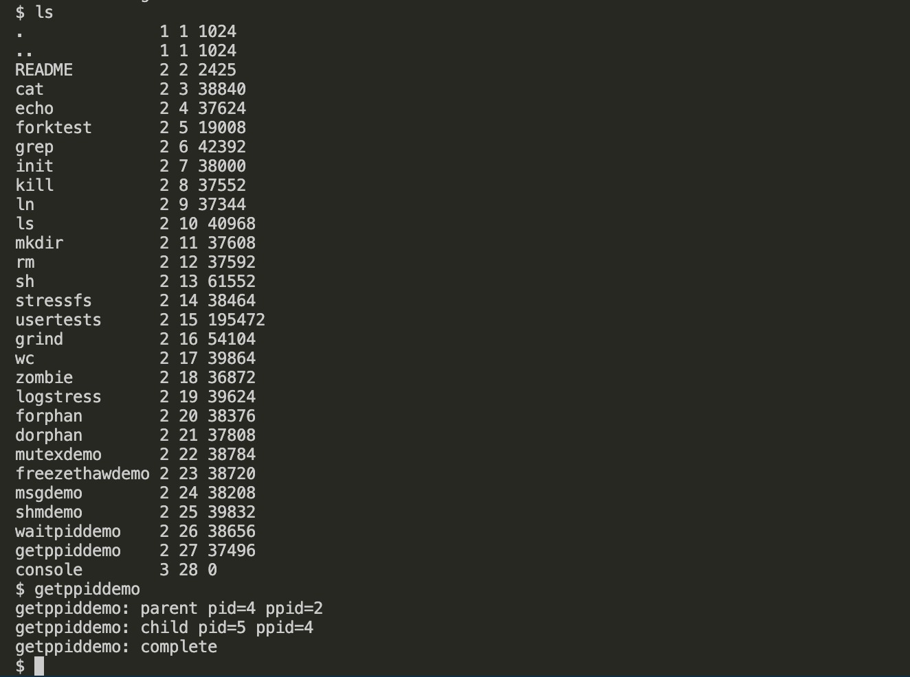

# G16 Project 1 - xv6 System Calls

## Team Members
- Rachit Kumar Pandey [24JE0677]
- Rahul Joshi [24JE0678]
- Raj Priyadarshi [24JE0679]
- Rajarshi Chakraborty [24JE0680]
- Ramala Karthik [24JE0681]
- Ranish Garg [24JE0682]

## Features Implemented

### Feature 1
- Feature: Kernel mutex lock table
- Syscalls: mutex_create, mutex_lock, mutex_unlock
- Description: Creates mutex id in kernel and supports lock/unlock from user processes.
- The mutex table is maintained in kernel space with fixed entries, and each entry tracks whether it is used, locked, and current owner pid.
- mutex_create allocates a free slot and returns its mutex id so user programs can share the same lock id across processes.
- mutex_lock blocks the caller when the mutex is already held and wakes it when the lock becomes available.
- mutex_unlock validates ownership before releasing, which prevents another process from unlocking a mutex it does not own.
- This feature demonstrates safe synchronization and controlled access to shared critical sections in xv6.
- Added By: Rachit Kumar Pandey
- Demo Program: mutexdemo

### Feature 2
- Feature: Process freeze and thaw control
- Syscalls: freeze, thaw
- Description: Allows one process to temporarily pause another runnable process and later resume it.
- freeze(pid) marks the target process as frozen, and the scheduler skips that process until thaw is called.
- thaw(pid) clears the frozen state and allows the process to run again in normal scheduling.
- The implementation is integrated with process lifecycle logic so freeze state is reset on process reuse.
- The kill path also clears freeze state so killed processes are not stuck indefinitely.
- Added By: Rachit Kumar Pandey
- Demo Program: freezethawdemo

## How To Run Demo
1. cd xv6-riscv
2. make qemu
3. Run in xv6 shell: mutexdemo
4. Run in xv6 shell: freezethawdemo

## Feature 3 
- **Feature**: Message queue based IPC system 
- **Syscalls**:  
    1. msgget(int key)
    2. sendmsg(int quid, int type, char* msg, int msglen)
    3. recvmsg(int quid, int type, char* buffer, int bufflen)
- **msgget**
    - ***input params***: 
        - integer key `(eg. msgget(123))`
    - ***returns***: 
        - success  message queue id `int` 
        - failure  `-1`
    - ***Kernel data structures created***: 
        - message (struct with data,type)
        - msgq (message queue struct with array of messages and other required data) 
        > for more information see [msg.c](xv6-riscv/kernel/msg.c) and [msg.h](xv6-riscv/kernel/msg.h)
    - ***description***:
        msgget allows processes to get/create a message queue with a integer key which allows inter process communication. if a queue with the given key already exists, it returns the existing queue id. otherwise assigns a new queue entry in the kernel
    - ***implementation details***:
        - a array of queues `msgq` is maintained to store   queues (type `msgqueue`)
        - each index of `msgq` is a queue (eg. msgq[0] is q0)
        - every queue contains a variable `used` to know whether queue is being allocated or not
        - `key` is used to identify the queue uniquely which is stored in each queue 
        - when msgget is called first unused queue is allocated and it's `id` (array idx) is returned 
        - spinlock `msgqlock` is used to prevent race conditions
-  **sendmsg**
    - ***input params***: 
        - queue id `int` 
        - message type `int`
        - message buffer `char*`
        - message length `int`
    - ***returns***: 
        -  0    `success`
        - -1    `failure`
    - ***description***: 
        `sendmsg` allows a user program to send a message (byte buffer) to a message queue with id quid. the receiving program must call recvmsg on the same queue to retrieve the message
    ***implementation details***: 
        - messages are stored in a fixed size array and `valid` flag is used to track active entries
        - uses copyin to safely transfer data from user space to kernel space 
        - uses spinlock `msgqlock` to enforce mutual exclusion while modifying queue state
        - returns error `-1` if queue is full or invalid queue id or message length exceed the limit (128 bytes)
        > max msg len: 128 bytes
- **recvmsg**
    - ***Input params***:
        - queue id `int`
        - type `int`
        - user buffer (where msg should be copied) `char*`
        - buffer len `int`
    - ***returns***:
        - success `copied msg len`
        - failure `-1`
    - ***description***: 
        - `recvmsg` allows a user program to retrieve the msg of desired type from the msg queue.
        user program must provide the queue id of the queue it want to receive message from.
        the implementation is non-blocking (returns right away -1 if no message of desired type found)
    - ***implementation details***: 
        - `recvmsg` is `non-blocking` (returns -1 right away if no message of desired type found)
        -  `copyout` is used to safely copy from kernel buffer to user buffer 
        - uses `valid` variable to track whether message is active
        - linearly searches the queue with provided quid for the desired message type
        - returns the first message found of the requested message type
-   **Added By**: Ramala Karthik (24JE0681)
    **Demo Program**: [msgdemo](xv6-riscv/user/msgdemo.c)

        
## How To Run Demo
1. cd xv6-riscv
2. make clean && make qemu
3. Run in xv6 shell: msgdemo

## Feature 4
- **Feature**: Shared memory based IPC system
- **Syscalls**:
    1. shmget(int key, int size)
    2. shmat(int id)
    3. shmdt(int id)
- **shmget**
    - ***input params***:
        - integer key (e.g. `shmget(42, 4096)`)
        - integer size in bytes (max 16384 bytes / 4 pages)
    - ***returns***:
        - success: shared memory segment id `int`
        - failure: `-1`
    - ***description***:
        shmget allows processes to get/create a shared memory segment with an integer key. if a segment with the given key already exists, it returns the existing segment id. otherwise allocates physical pages and assigns a new segment entry in the kernel.
    - ***implementation details***:
        - a fixed-size array `shmtable[8]` of `struct shmseg` is maintained in kernel space
        - each entry tracks: `used`, `key`, `size`, `npages`, physical addresses `pa[]`, and `refcount`
        - spinlock `shmlock` is used to prevent race conditions
        - physical pages are allocated with `kalloc()` and zeroed on creation
- **shmat**
    - ***input params***:
        - segment id `int`
    - ***returns***:
        - success: virtual address `char*` where the segment is mapped
        - failure: `-1`
    - ***description***:
        shmat attaches a shared memory segment to the calling process's virtual address space. the segment is mapped just below TRAPFRAME at a fixed address based on the segment id, so multiple processes map the same physical pages to the same virtual address.
    - ***implementation details***:
        - uses `mappages()` to map the segment's physical pages into the process's page table with `PTE_R | PTE_W | PTE_U` permissions
        - each segment is mapped at `TRAPFRAME - (id+1) * MAX_SHM_SIZE` to avoid collisions
        - increments `refcount` on successful attach
        - if already attached, returns the existing virtual address
- **shmdt**
    - ***input params***:
        - segment id `int`
    - ***returns***:
        - success: `0`
        - failure: `-1`
    - ***description***:
        shmdt detaches a shared memory segment from the calling process. the virtual address mappings are removed but the physical pages are not freed until all processes have detached (refcount reaches 0).
    - ***implementation details***:
        - uses `uvmunmap()` with `do_free=0` to unmap without freeing physical pages
        - decrements `refcount`; when refcount reaches 0, physical pages are freed with `kfree()` and the segment slot is released
        - on process exit (`freeproc`), any attached segments are auto-detached
- **Added By**: Ranish Garg

- **Demo Program**: shmdemo

## How To Run Demo
1. cd xv6-riscv
2. make clean && make qemu
3. Run in xv6 shell: shmdemo

## Feature 5
- Feature: waitpid for targeted child wait
- Syscall: waitpid(int pid, int *status)
- Description: Allows a parent process to wait for a specific child PID instead of waiting for any child.
- The implementation reuses xv6 wait-lock discipline and process table scan style used by existing wait logic.
- waitpid validates that the requested PID belongs to one of the caller's children.
- If the target child has already exited, waitpid returns immediately with that child's PID and copies exit status to user memory.
- If the target child is still running, the parent sleeps and resumes when child state changes.
- Returns -1 for invalid PID, non-child PID, or copyout failure.
- Added By: Raj Priyadarshi [24JE0679]
- Demo Program: waitpiddemo

## How To Run waitpid Demo
1. cd xv6-riscv
2. make clean && make qemu
3. Run in xv6 shell: waitpiddemo

## Feature 6
- Feature: getppid for parent PID lookup
- Syscall: getppid(void)
- Description: Returns the parent process ID of the calling process.
- The implementation reads the process parent pointer under wait-lock protection and returns parent pid.
- For processes without a parent pointer (for example early/root contexts), syscall returns 0.
- Added By: Raj Priyadarshi [24JE0679]
- Demo Program: getppiddemo

## How To Run getppid Demo
1. cd xv6-riscv
2. make clean && make qemu
3. Run in xv6 shell: getppiddemo

## Additional Analysis and Functionalities Added (April 2026)

### Analysis of Existing Design
- Existing syscall dispatch was already extended in `kernel/syscall.h` and `kernel/syscall.c` for mutex, freeze/thaw, message queue IPC, shared memory IPC, waitpid, and getppid.
- Process-level state extensions (`frozen`, shared memory bookkeeping) are stored in `struct proc` and handled in `kernel/proc.c` lifecycle paths.
- IPC primitives are backed by global kernel tables guarded by spinlocks (`msgqlock`, `shmlock`), and user access is mediated by copyin/copyout.
- Synchronization support existed with blocking lock and unlock, but lacked non-blocking acquisition.
- Signal-like behavior existed implicitly through `kill`, `freeze`, and `thaw`, but without a unified signal interface.

### New Feature 7
- Feature: Batch process creation
- Syscall: `forkn(int n)`
- Description: Creates up to `n` child processes in one syscall and returns number created to the parent.
- Category: Process creation

### New Feature 8
- Feature: Thread-style start function creation
- Syscall: `thread_create(void *start, void *arg)`
- Description: Creates a process-backed execution context that starts from `start(arg)` directly in user mode.
- Category: Threads

### New Feature 9
- Feature: Non-blocking mutex acquisition
- Syscall: `mutex_trylock(int id)`
- Description: Attempts to acquire a mutex immediately and returns `-1` if already held, avoiding sleep/block behavior.
- Category: Locks

### New Feature 10
- Feature: Unified basic signal dispatch
- Syscall: `signal_send(int pid, int sig)`
- Description: Adds one signal entry point for `SIG_TERM(1)`, `SIG_STOP(2)`, `SIG_CONT(3)` mapped to kill/freeze/thaw semantics.
- Category: Signals

### New Feature 11
- Feature: Message queue depth query
- Syscall: `msgcount(int qid)`
- Description: Returns the current number of pending messages in a queue.
- Category: IPC

### New Demo Program
- Program: `advancedsysdemo`
- Demonstrates: `forkn`, `thread_create`, `mutex_trylock`, `signal_send`, and `msgcount` in a single run.
- Added By: Rajarshi Chakraborty [24JE0680]

### How To Run New Demo
1. `cd xv6-riscv`
2. `make clean && make qemu`
3. Run in xv6 shell: `advancedsysdemo`

### Screenshot Attachment
- Attach your execution screenshot at: `screenshots/advancedsysdemo.png`
- The documentation reference image tag:

### Feature 12
- Feature: Mutex ownership introspection
- Syscall: mutex_owner(int id)
- Description: Returns lock owner pid for a valid mutex id.
- Return values:
    - >0: pid of current owner
    - 0: mutex exists but is currently unlocked
    - -1: invalid mutex id or unused slot
- Added By: Rahul Joshi [24JE0678]
- Demo Program: sys2demo

### Feature 13
- Feature: Process state introspection
- Syscall: getprocstate(int pid)
- Description: Returns internal xv6 process state for a given pid.
- State values:
    - 0 UNUSED
    - 1 USED
    - 2 SLEEPING
    - 3 RUNNABLE
    - 4 RUNNING
    - 5 ZOMBIE
    - -1 for invalid/non-existing pid
- Added By: Rahul Joshi [24JE0678]
- Demo Program: sys2demo

### Analysis of Existing Design for Feature 12 and Feature 13
- Syscall dispatch is routed through kernel/syscall.h and kernel/syscall.c.
- User entry stubs are generated from user/usys.pl and declared in user/user.h.
- Process state is stored in struct proc and protected using per-process locks.
- Kernel mutex entries are stored in a fixed table in kernel/sysproc.c and synchronized with wait_lock.
- Based on this architecture:
    - mutex_owner reads the mutex table and returns current owner information.
    - getprocstate scans process table safely and returns process state enum.

## How To Run Feature 12 and Feature 13 Demo
1. cd xv6-riscv
2. make clean && make qemu
3. Run in xv6 shell: sys2demo

## Screenshot Attachment
- Attach screenshot at: screenshots/sys2demo.png

## Execution Screenshots (Available)

### Feature 1 - mutexdemo

### Feature 2 - freezethawdemo

### Feature 3 - msgdemo

### Feature 4 - shmdemo

### Feature 5 - waitpid demo

### Feature 6 - getppid demo

### Feature 12 and 13 - sys2demo

        
    

